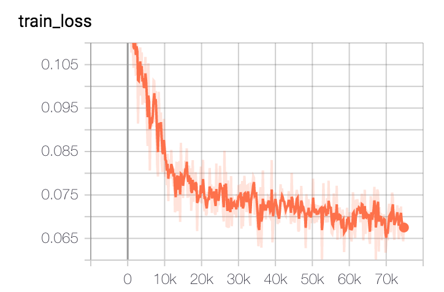
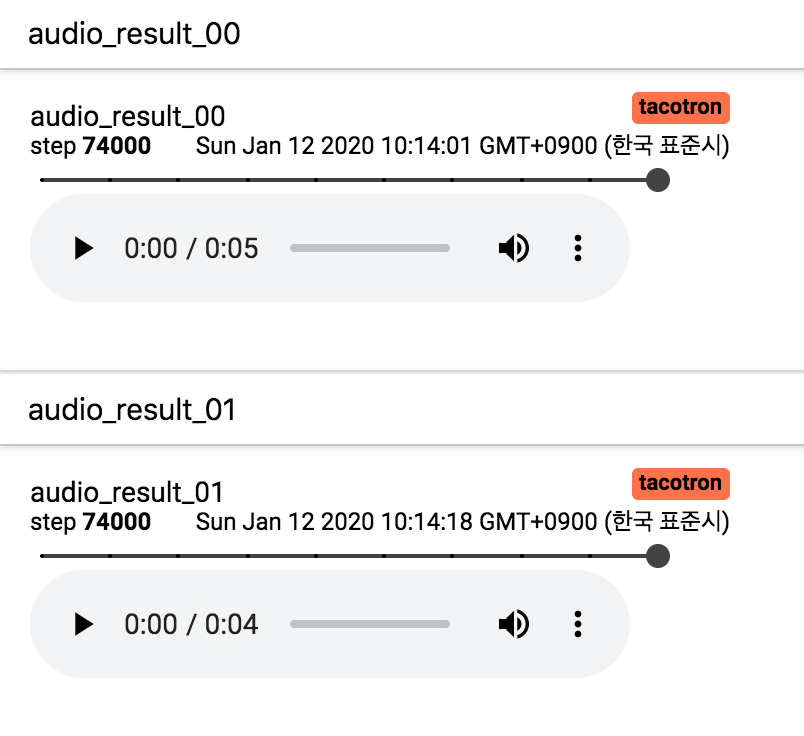
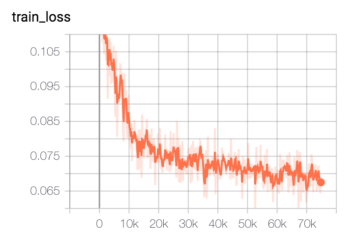
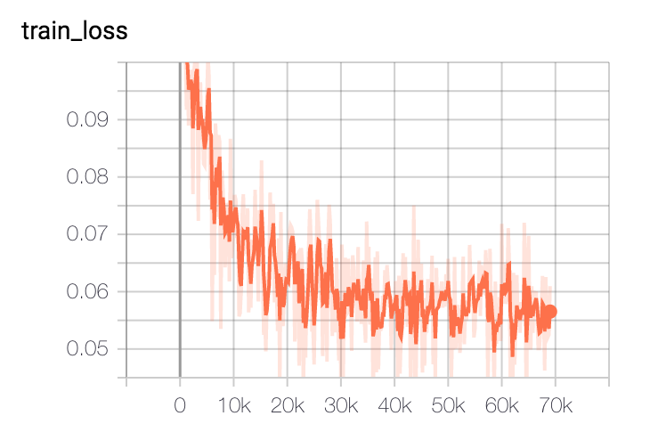

#  Tacotron

An implementation of Tacotron described in the paper using pytorch.
[Tacotron: Towards End-to-End Speech Synthesis
](https://arxiv.org/abs/1703.10135) 

Published in INTERSPEECH 2017

## Requirement
- torch 1.3.0
- falcon 1.2.0
- inflect 0.2.5
- librosa 0.5.1
- numpy 1.13.3
- scipy 1.0.0
- Unidecode 0.4.21
- pandas 0.21.0

## Datasets
- [LJ-Speech](https://keithito.com/LJ-Speech-Dataset/)
(English)
- [KSS-dataset](https://www.kaggle.com/bryanpark/korean-single-speaker-speech-dataset)
(Korean)
 
## Pre-trained model
- [LJ-Speech(English)](https://drive.google.com/open?id=1xVqe2Tvb4SurQxwIfPbft6i-GmFUTXef)
- [KSS-dataset(Korean)](https://drive.google.com/open?id=17pGdhySRUwmirN4t0pdSgyxAGtiNYKvH)


## Model training
### Train using LJ-Speech dataset

```
python train.py
```

### Train using KSS-dataset
1) Change options in hyperparams.py

- cleaners option (26-th line) : from 'english\_cleaners' to 'korean\_cleaners'
- dataset option (29-th line) : from 'LJSpeech' to 'KSS'
- data\_path option (30-th line)

2) Change the sample sentences for generating TTS wav files from english to korean during training. (xx-th line in train.py)

3)
```
python train.py
```

### Tensorboard
- You can see the train loss graph.
- Furthermore, you can listen to generated wav files during training.

| Loss | wav_files |
| --- | --- |
|  | |

```
tensorboard --logdir=runs
```

## Generate TTS wav files
1) Download pre-trained model. 

- [LJ-Speech(English)](https://drive.google.com/open?id=1xVqe2Tvb4SurQxwIfPbft6i-GmFUTXef)
- [KSS-dataset(Korean)](https://drive.google.com/open?id=17pGdhySRUwmirN4t0pdSgyxAGtiNYKvH)

2) Change option in hyperparams.py

- If you want to generate english wav files, cleaners option (26-th line) should be 'english\_cleaners' 
- And if you want to generate korean wav files, cleaners option (26-th line) should be 'korean\_cleaners'

3) Generate TTS wav files


```
python eval.py --checkpoint_path ./pre_trained_model_path
```


## Experimental Results
### Train loss
| LJ-Speech | KSS |
| --- | --- |
|  | |


### TTS wav files
[LJ-results(English)](https://drive.google.com/open?id=1ZeTA_ZFBy3dd6rSKNj9u3JXP94YftIWT)

[KSS-results(korean)](https://drive.google.com/open?id=1zbJdFHJJEiJWR-8ja0XAkfIhMdk1Ycey)

## Comments
If you have any questions or comments on my codes, please email to me. [son1113@snu.ac.kr](mailto:son1113@snu.ac.kr)

## Reference
[1] https://github.com/soobinseo/Tacotron-pytorch

[2] https://github.com/hccho2/Tacotron-Wavenet-Vocoder-Korean